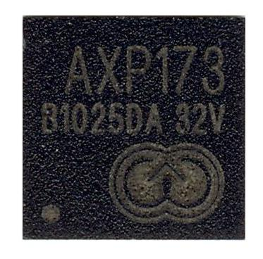
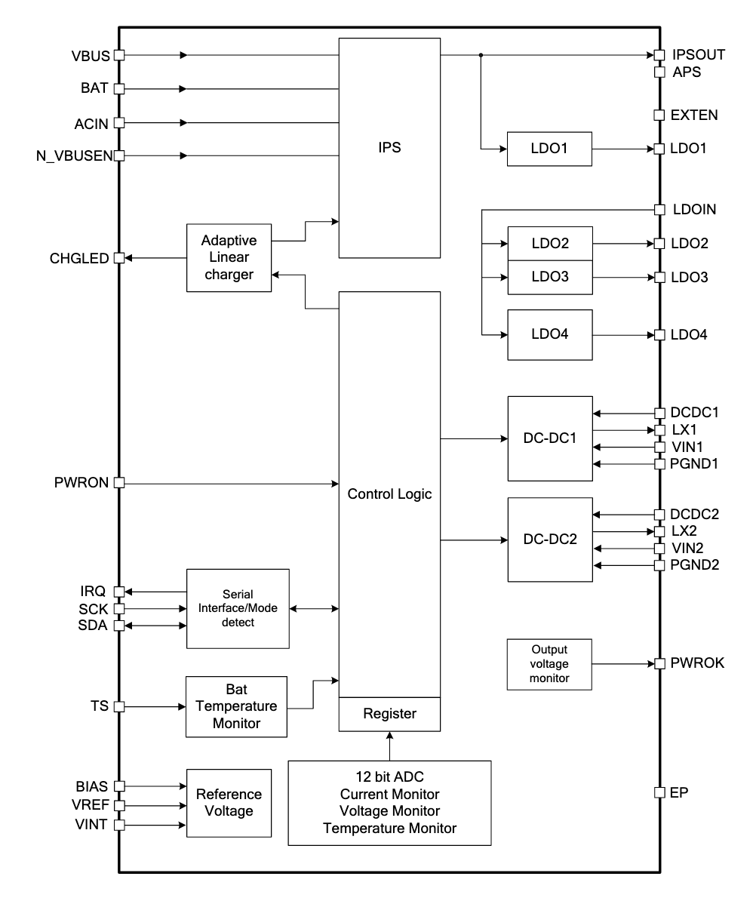

## `axp173`


[](https://crates.io/crates/axp173)
[](https://crates.io/crates/axp173)



## What is this?

This is a [embedded-hal](https://github.com/rust-embedded/embedded-hal) driver 
for X-Powers' Power Management IC [AXP173](http://www.x-powers.com/en.php/Info/product_detail/article_id/27).

It's device-agnostic and uses embedded-hal's `Write`/`WriteRead` for I2C communication.

## Usage

1. Add dependency to `Cargo.toml`:

    ```bash
    cargo add axp173
    ```
    
2. Instantiate and init the device:

    ```rust
    // ... declare and configure your I2c peripheral ...
    
    // Init AXP173 PMIC
    let axp173 = axp173::Axp173::new(i2c);
    axp173.init()?;
    Ok(axp173)
    ```

3. Configure the PMIC

   ```rust
   // Set charging current to 100mA
   axp173
       .set_charging_current(ChargingCurrent::CURRENT_100MA)?;

   // Enable internal ADCs
   // 25Hz sample rate, Disable TS, enable current sensing ADC
   axp173
       .set_adc_settings(
           AdcSettings::default()
               .set_adc_sample_rate(AdcSampleRate::RATE_25HZ)
               .ts_adc(false)
               .set_ts_pin_mode(TsPinMode::SHUT_DOWN)
               .vbus_voltage_adc(true)
               .vbus_current_adc(true)
               .batt_voltage_adc(true)
               .batt_current_adc(true),
       )?;

   // Enable battery gas gauge
   axp173.set_coulomb_counter(true)?;
   axp173.resume_coulomb_counter()?;

   // Power-off the device after 4 seconds of
   // long press of power button
   axp173.set_shutdown_long_press_time(ShutdownLongPressTime::SEC_4)?;
   ```

## Details and examples

TODO

## Status

What is done and tested and what is not yet:

- [x] Coulomb counter reading
- [x] Coulomb counter control
- [ ] DC/DC settings
- [ ] IRQs
- [x] Battery voltage & current readings
- [x] VBUS voltage & current readings
- [ ] Temperature sensor readings
- [x] AXP173 on-chip buffer
  - [x] Reading
  - [x] Checking default values
  - [x] Writing
- [x] AXP173 LDO2, LDO3, LDO4 enable/disable
- [x] LDO voltage setup
- [x] VBUS presence
- [x] Battery presence
- [x] Battery charging status
- [x] Charging current setup
- [x] Charging regulated voltage setup
- [x] Internal ADC settings:
  - [x] Sample rate
  - [x] Enable/Disable various ADC channels (batt. voltage, current, etc.)
- [x] Button settings
- [ ] Instantaneous battery power reading
